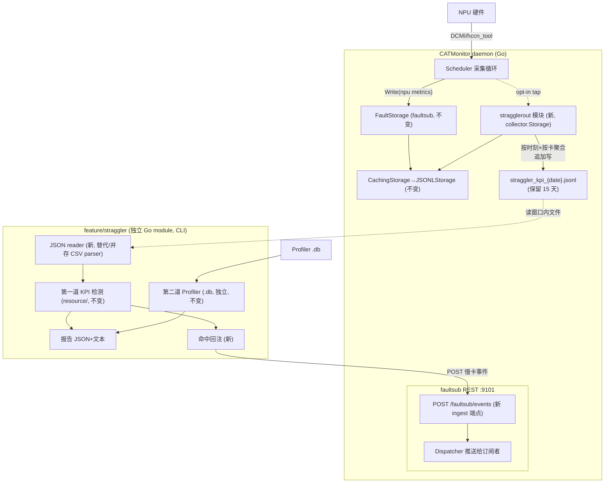
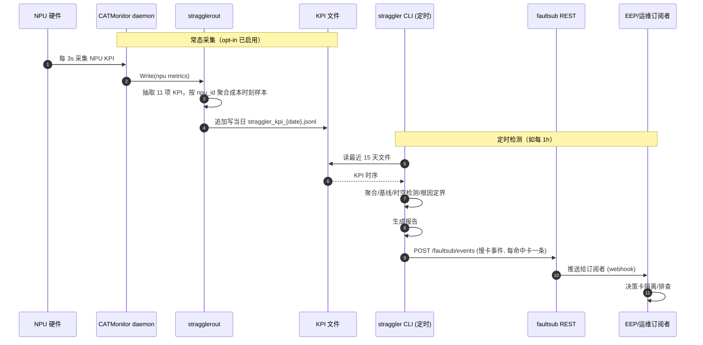

# Straggler 慢节点检测 与 CATMonitor 整合设计方案 (straggler_combination_DESIGN)

> **文档定位**：本文档描述将 straggler（慢节点/慢卡检测）特性合入 CATHelper、以 CATMonitor 为底座的设计方案，作为后续编码实现的依据。
>
> **范围**：① CATMonitor 新增 opt-in 的 straggler 专用 KPI 文件输出；② straggler 改造为独立 Go module，读该文件做检测，并把命中结果回注 CATMonitor faultsub；③ straggler 第二道防线（Profiler）保留独立。
>
> **相关代码**：
> - 底座：`CATMonitor/`（Go module `github.com/Computing-Availability-Tools/CATMonitor`）
> - straggler：`feature/straggler/`（待重构为独立 Go module）
> - 参考：EEP 整合 `feature/elastic-ep/EEP_combination_DESIGN.md`、faultsub `CATMonitor/features/faultsub/faultsub_SPEC.md`

---

## 1. 背景与目标

### 1.1 straggler 是什么

straggler 是 AI 智算集群中识别性能劣化 NPU 卡的**两道防线**检测体系（Go，当前为 `go run .` 一次性 CLI）：

| 防线 | 包 | 输入 | 方法 | 输出 |
|------|----|------|------|------|
| 第一道（KPI 资源检测） | `resource/` | KPI 时序 CSV（`kpi_collect.sh` 采集，分钟级，15 天基线） | 时间×空间双维 Z-score + 二维交叉验证 + 根因定界 | JSON + 文本报告 |
| 第二道（Profiler 检测） | `profiling/` | Ascend PyTorch Profiler `.db` SQLite（应用级、按需触发） | 均质化聚类：慢计算/慢通信/慢CPU/Bubble | JSON + 文本报告 |

### 1.2 核心问题

straggler 第一道防线**自带 `kpi_collect.sh` 采集 KPI**，与 CATMonitor 底座**未衔接**。而 CATMonitor 已每 3s 采集 NPU 卡级 KPI 指标（温度/功耗/频率/利用率/带宽/RoCE 计数器等），**正是第一道所需**。第二道（Profiler `.db`）属应用级数据，CATMonitor 不采集，应保留 straggler 独立读取。

### 1.3 已确认的整合决策（来自讨论）

| # | 决策 | 选择 |
|---|------|------|
| 1 | 接入范围 | **仅第一道（KPI）** 接入 CATMonitor；第二道（Profiler）保留独立 |
| 2 | KPI 数据获取 | CATMonitor **新增 opt-in 的 straggler 专用 KPI 文件**（启用才输出，不启用零影响）；straggler 读该文件 |
| 3 | 运行模式 | straggler **保留 CLI/定时调度**（检测本质是批量，需历史窗+基线，不适合作实时 tap） |
| 4 | 模块结构 | straggler 作为 **`feature/straggler` 独立 Go module**（自带 go.mod，重构 import），外部消费 CATMonitor 数据，与 EEP 结构一致 |
| 5 | 结果消费 | **报告 + 回注 faultsub**：straggler 检测命中后，把"慢卡事件"POST 给 CATMonitor faultsub（faultsub 新增事件 ingest 端点），供 EEP/运维据此触发卡隔离 |

### 1.4 目标

1. **CATMonitor 新增 straggler KPI 输出**：opt-in 特性模块，按 straggler 需要的"每时刻含全部卡"格式输出 KPI 时序文件，默认关闭、零回归。
2. **straggler 改造为独立 module**：重构 import 路径；新增 JSON reader 读 CATMonitor 输出文件（与现有 CSV parser 并存）；保留 CLI 运行。
3. **检测命中回注 faultsub**：straggler 把命中的慢卡作为事件 POST 给 faultsub，经 faultsub 推送给订阅者（EEP/运维），闭环"采集→检测→响应"。
4. **补齐指标缺口**：CATMonitor 补充 `roce_new_pkt_rty` 计数器（straggler 需要、CATMonitor 暂无）。

---

## 2. 现状分析

### 2.1 straggler 第一道 KPI 指标需求 vs CATMonitor 覆盖

straggler `resource/types.go` 定义 11 项 KPI（`CSVRow`）：

| straggler 指标 | 类别 | 方向 | CATMonitor 指标 | 状态 |
|---|---|---|---|---|
| `temp` | 计算 | 高异常 | `npu/temperature` | ✓ |
| `power` | 计算 | 高异常 | `npu/power_draw` | ✓ |
| `aicore_freq` | 计算 | 低异常 | `npu/aicore_freq` | ✓ |
| `aicore_util` | 计算 | 低异常 | `npu/utilization` | ✓ 名称映射 |
| `hbm_util` | 计算 | 低异常 | `npu/memory_usage` | ✓ 名称映射 |
| `tx_bandwidth` | 通信 | 低异常 | `npu/net_tx_bandwidth` | ✓ 名称映射 |
| `rx_pfc_pkt` | 通信(计数器) | 高异常 | `npu/mac_rx_pfc_pkt_num` | ✓ 名称映射 |
| `roce_tx_err_pkt` | 通信(计数器) | 高异常 | `npu/roce_tx_err_pkt_num` | ✓ 精确 |
| `roce_out_of_order` | 通信(计数器) | 高异常 | `npu/roce_out_of_order_num` | ✓ 精确 |
| `roce_new_pkt_rty` | 通信(计数器) | 高异常 | （无） | **✗ 缺口** |
| `cpu_average` | 主机 | — | `cpu/usage` | ✓ 名称映射 |

**覆盖 10/11，缺口 1 项**（`roce_new_pkt_rty`，RoCE 重传计数器）。计数器语义：straggler 把后 4 项当累计计数器处理（聚合时累加），CATMonitor 的 hccn_tool 统计指标本就是累计计数器，语义一致。

### 2.2 straggler 数据格式 vs CATMonitor 输出

- straggler 期望：每行一个时刻，每个指标是一个 `cardID→value` 的 JSON dict（CSVRow）。
- CATMonitor 现状：JSONL 每行**一个指标**（`{component,name,value,labels:{npu_id}}`），按部件按天分文件。
- 结论：格式不同，需 CATMonitor 侧做"按时刻×按卡"的聚合输出（这正是决策 2 的"专用 KPI 文件"）。

### 2.3 工程问题

1. **模块路径**：straggler 现 import `github.com/Computing-Availability-Tools/CATMonitor/features/straggler/...`，但已移至 `feature/straggler`（与 elastic-ep 并列），需重构为独立 module。
2. **基线保留期**：straggler 默认 15 天基线；CATMonitor 现默认 `max_file_age=168h`(7 天)。straggler KPI 文件需独立保留期（默认 15 天）。
3. **SQLite 依赖**：straggler 第二道用 `modernc.org/sqlite`（纯 Go，无 CGo），独立 module 需自带该依赖。

---

## 3. 总体架构

### 3.1 整合前后对比

**整合前**（当前）：

```
kpi_collect.sh ──CSV──> straggler(CLI) ──> 报告
Profiler .db ──────────> straggler(CLI) ──> 报告
```

**整合后**（目标）：

```
NPU 硬件 ──DCMI/hccn_tool──> CATMonitor(NPU采集器) ──> Storage管道
                                ├── JSONL 落盘（不变）
                                ├── Prometheus /metrics（不变）
                                ├── faultsub 故障订阅（EEP 用，不变）
                                └── [新] stragglerout KPI 文件（opt-in，按时刻×按卡聚合）
                                        │ straggler_kpi_{date}.jsonl
                                        ▼
                        straggler(CLI/定时) ──读 KPI 文件──> 第一道检测
                                │ 命中慢卡
                                ▼
                        [新] POST faultsub /faultsub/events（ingest）
                                │
                                ▼
                        faultsub 推送给订阅者(EEP/运维) ──> 触发卡隔离/排查
Profiler .db ──────────> straggler 第二道（保留独立）
```

### 3.2 总体架构图



### 3.3 端到端时序



---

## 4. CATMonitor 侧改造

### 4.1 新增 `features/stragglerout/` 模块

照 `features/faultsub`/`exporter` 的"Storage 插件"模式，新增 opt-in 模块 `stragglerout`，作为 `collector.Storage` 包装在最外层，仅处理 NPU 批次，按时刻×按卡聚合后追加写 KPI 文件。

#### 4.1.1 目录结构

```
features/stragglerout/
├── stragglerout_SPEC.md      # 模块设计规格
├── storage.go                # StragglerStorage：实现 collector.Storage（管道 tap）
├── sample.go                 # KPI 样本数据模型 + 11 项指标抽取/映射
├── writer.go                 # 日级文件追加写 + 保留期清理
├── config.go                 # 配置结构
├── storage_test.go           # tap 委托 + 样本聚合测试
├── sample_test.go            # 指标映射/计数器处理测试
└── writer_test.go            # 日级写/轮转/保留期测试
```

#### 4.1.2 Storage 接入：`StragglerStorage`（storage.go）

```go
type StragglerStorage struct {
    inner   collector.Storage          // 委托 CachingStorage（落盘/缓存，不变）
    mapper  *KPIMapper                 // 11 项指标映射
    writer  *KPIWriter                // 日级文件写
    bufMu   sync.Mutex
    buffer  []KPISample               // 内存缓冲，周期 flush
    lastFlush time.Time
    logger  *slog.Logger
}

func (s *StragglerStorage) Write(metrics []collector.Metric) error {
    if err := s.inner.Write(metrics); err != nil { s.logger.Error(...) }
    sample := s.mapper.Extract(metrics)   // 抽取 npu 指标→按 npu_id 聚合
    if sample != nil {
        s.bufferSample(sample)
        if time.Since(s.lastFlush) > s.flushInterval { s.flush() }
    }
    return nil
}
```

- 仅处理 `component=="npu"` 批次；其它 component 透传。
- 内存缓冲 + 周期 flush（默认 60s），避免每 3s 重写文件。
- 计数器指标（rx_pfc_pkt 等）写**原始累计值**，由 straggler 侧聚合时累加（语义对齐 straggler 现有逻辑）。

#### 4.1.3 KPI 样本格式契约（sample.go）

每条样本 = 一个时刻的"全部卡 × 11 项指标"，与 straggler `CSVRow` 1:1 对应。文件为 **JSONL**（每行一个 JSON 样本，追加友好、日级轮转，与 CATMonitor 既有 JSONL 风格一致）：

```json
{"ts":1784547926,"vals":{"0":{"temp":47,"power":1628,"aicore_freq":1800,"aicore_util":45,"hbm_util":50,"tx_bandwidth":1250,"rx_pfc_pkt":0,"roce_tx_err_pkt":0,"roce_out_of_order":0,"roce_new_pkt_rty":0},"1":{...}},"cpu_avg":{"cpu1":"4.26"}}
```

> **为何 JSONL 而非单体 JSON**：单体 JSON 追加需重写全文；JSONL 每行独立、追加 O(1)、日级轮转天然适配、读取流式。文件名 `straggler_kpi_{date}.jsonl`，目录 `{data_dir}/straggler/`，保留期 `straggler_output.retention`（默认 360h=15 天）。

#### 4.1.4 指标映射表（sample.go `KPIMapper`）

| straggler 字段 | CATMonitor metric.Name | 来源 |
|---|---|---|
| temp | `temperature` | npu |
| power | `power_draw` | npu |
| aicore_freq | `aicore_freq` | npu |
| aicore_util | `utilization` | npu |
| hbm_util | `memory_usage` | npu |
| tx_bandwidth | `net_tx_bandwidth` | npu |
| rx_pfc_pkt | `mac_rx_pfc_pkt_num` | npu (hccn_tool) |
| roce_tx_err_pkt | `roce_tx_err_pkt_num` | npu (hccn_tool) |
| roce_out_of_order | `roce_out_of_order_num` | npu (hccn_tool) |
| roce_new_pkt_rty | `roce_new_pkt_rty`（**新增，见 §4.3**） | npu (hccn_tool) |
| cpu_avg | `usage` | cpu（按 cpu 标签聚合） |

### 4.2 faultsub 新增事件 ingest 端点（回注支撑）

straggler 检测命中后需把事件"回注"faultsub，经 faultsub 推送给订阅者。faultsub 现仅有"推出"能力，需新增一个 ingest 端点：

`POST /faultsub/events`（`features/faultsub/server.go` 增路由）：

```go
// 接收一个 FaultEvent（或一组），写入环形缓冲 + Dispatch 推送给订阅者。
// 供 straggler 等外部检测器回注命中事件。
func (s *apiServer) handleIngestEvent(w, r) {
    var ev FaultEvent
    json.NewDecoder(r.Body).Decode(&ev)
    if ev.EventID == "" { ev.EventID = newEventID() }
    if ev.Timestamp.IsZero() { ev.Timestamp = time.Now() }
    s.disp.Dispatch(ev)        // 走与内部检测同样的分发/去抖/推送
    w.WriteHeader(http.StatusAccepted)
}
```

新增 `FaultType`：`FaultStragglerDetected = "straggler_detected"`（`event.go`）。straggler 回注的事件 `type=straggler_detected`，`detail` 含 `root_cause`(thermal_throttle/network_link_issue/straggler/...)、`quadrant`、`composite_score`、`anomaly_category`(compute/communication)。订阅者（EEP/运维）按 root_cause 决策：thermal/network → 排查；straggler → 触发 Profiler 精查或卡隔离。

### 4.3 补齐指标缺口：`roce_new_pkt_rty`（hccn_tool）

CATMonitor 的 hccn_tool 统计暂无 `roce_new_pkt_rty`（RoCE 重传计数器）。在 `internal/source/hccn_tool/hccn_tool.go` 的 statistics 解析中新增该字段（若 CANN hccn_tool 提供 `roce_new_pkt_rty`/重传统计），并在 `metrics.yaml` 登记（Medium）。straggler 的 `MetricRocENewPktRty` 即可从 CATMonitor 取到。

> 若 hccn_tool 实际无该字段，降级方案：映射到语义最近的 `roce_rx_cnp_pkt_num`（CNP 触发降速，可作重传代理）并在文档标注代理关系——需真机确认。本设计先按"新增"处理。

### 4.4 配置（`internal/config/config.go` + `configs/catmonitor.yaml`）

```yaml
straggler_output:
  enabled: false                # opt-in，默认不输出 KPI 文件
  data_dir: /var/lib/catmonitor/straggler   # KPI 文件目录
  retention: 360h              # 保留期（默认 15 天，匹配基线窗口）
  flush_interval: 60s          # 内存缓冲 flush 周期
  metrics:                     # 输出哪些指标（默认全 11 项）
    - temp
    - power
    - aicore_freq
    - aicore_util
    - hbm_util
    - tx_bandwidth
    - rx_pfc_pkt
    - roce_tx_err_pkt
    - roce_out_of_order
    - roce_new_pkt_rty
```

`Config` 增 `StragglerOutput StragglerOutputConfig`，`Default()` 中 `Enabled:false`。

### 4.5 daemon 集成（`cmd/catmonitor/main.go`）

```go
if cfg.StragglerOutput.Enabled {
    kpiw := stragglerout.NewKPIWriter(cfg.StragglerOutput.DataDir, cfg.StragglerOutput.Retention, logger)
    sstore := stragglerout.NewStragglerStorage(sink, kpiw, cfg.StragglerOutput, logger)
    sink = sstore   // 包在 faultsub 之外或之内（链式）
}
```

Storage 链：`Scheduler → StragglerStorage(若启用) → FaultStorage(若启用) → CachingStorage → JSONLStorage`。三者皆 opt-in、互不影响。

### 4.6 CATMonitor 侧变更清单

| 文件 | 变更 |
|------|------|
| `features/stragglerout/`（新，8 文件） | KPI 输出模块（Storage tap + 样本映射 + 日级写 + 测试） |
| `features/stragglerout/stragglerout_SPEC.md`（新） | 模块设计规格 |
| `features/faultsub/event.go` | 新增 `FaultStragglerDetected` 类型 |
| `features/faultsub/server.go` | 新增 `POST /faultsub/events` ingest 端点 + 测试 |
| `internal/source/hccn_tool/hccn_tool.go` | 新增 `roce_new_pkt_rty` 统计字段 |
| `configs/metrics.yaml` | 登记 `roce_new_pkt_rty`（Medium） |
| `internal/config/config.go` | 新增 `StragglerOutputConfig`，默认 `Enabled:false` |
| `configs/catmonitor.yaml` | 新增 `straggler_output:` 段 |
| `cmd/catmonitor/main.go` | 装配 StragglerStorage（受 `cfg.StragglerOutput.Enabled` 门控） |

---

## 5. straggler 侧改造

### 5.1 独立 Go module + import 重构

- `feature/straggler/go.mod`（新）：`module github.com/Computing-Availability-Tools/CATHelper/feature/straggler`，依赖 `modernc.org/sqlite`（第二道用）。
- 全部 `.go` 的 import 路径 `github.com/Computing-Availability-Tools/CATMonitor/features/straggler/X` → `github.com/Computing-Availability-Tools/CATHelper/feature/straggler/X`（机械重构，main.go + 5 子包）。
- straggler **不 import CATMonitor 包**（外部消费其文件/REST），与 EEP 一致。

### 5.2 新增 JSON reader（替代/并存 CSV parser）

`resource/json_reader.go`（新）：读 `straggler_kpi_{date}.jsonl`（按日期范围），产出与 `ParseCSV` 相同的 `*TimeSeriesData`，复用后续聚合/基线/检测管线（零改动）：

```go
// ReadKPIFiles(dir string, since, until time.Time) (*TimeSeriesData, error)
//   遍历 [since,until] 范围的 straggler_kpi_{date}.jsonl，逐行反序列化 KPISample
//   → CSVRow（11 项 dict + CPUAvg），合并、按 ts 排序、收集 cardIDs
```

`main.go` 入口参数：`--kpi-jsonl-dir=DIR` 与 `--kpi-path=DIR`（遗留 kpi_collect.sh CSV 目录）二选一；若用 JSONL 模式按 `--baseline-hours`(默认 360) + `--detection-hours`(默认 1) 自动算窗口读文件。

### 5.3 检测命中回注 faultsub

`resource/emit.go`（新）：检测完成后，对每个 `QuadConfirmedAnomaly`/`QuadEarlyDegradation` 卡构造 `FaultEvent` 并 POST 给 faultsub：

```go
type FaultEvent struct {  // 与 CATMonitor faultsub 契约一致（JSON）
    EventID   string            `json:"event_id"`
    Type      string            `json:"type"`        // "straggler_detected"
    Component string            `json:"component"`   // "npu"
    NPUID     string            `json:"npu_id"`
    Severity  string            `json:"severity"`    // critical|warning
    Detail    map[string]string `json:"detail"`      // root_cause/quadrant/composite_score/anomaly_category
    Timestamp time.Time         `json:"timestamp"`
    Recovered bool              `json:"recovered"`
}

// EmitToFaultSub(results, faultsubURL, timeout): 逐卡 POST /faultsub/events
```

新增 CLI 参数 `--faultsub-url=http://localhost:9101`（回注目标，空=不回注，仅出报告）。

### 5.4 运行模式（CLI/定时）

保留 CLI，由外部 cron/定时器调度（如每 1h）：

```bash
go run . --kpi-jsonl-dir=/var/lib/catmonitor/straggler \
         --faultsub-url=http://localhost:9101 \
         --baseline-hours=360 --detection-hours=1
# 读最近 15 天 KPI → 第一道检测 → 报告 + 回注 faultsub
```

第二道（Profiler）保留不变：`go run . path=/data/profiler_output ...`。

### 5.5 straggler 侧变更清单

| 文件 | 变更 |
|------|------|
| `go.mod`（新） | 独立 module + `modernc.org/sqlite` |
| 全部 `.go` import | 路径重构为 `.../CATHelper/feature/straggler/...` |
| `resource/json_reader.go`（新） | JSONL reader → TimeSeriesData |
| `resource/emit.go`（新） | 检测命中 → faultsub 事件回注 |
| `main.go` | 新增 `--kpi-jsonl-dir`/`--faultsub-url`/`--baseline-hours`/`--detection-hours` 参数；JSONL 模式入口 |
| `README.md`/`SPEC.md` | 同步新参数与整合用法 |

---

## 6. 数据模型与接口契约

### 6.1 KPI 样本（CATMonitor→straggler 文件格式）

见 §4.1.3，每行一个 JSON 样本（JSONL），字段 1:1 对应 straggler `CSVRow`。

### 6.2 faultsub 事件（straggler→CATMonitor 回注）

```
POST /faultsub/events
{ "type":"straggler_detected", "component":"npu", "npu_id":"3",
  "severity":"critical",
  "detail":{"root_cause":"thermal_throttle","quadrant":"confirmed_anomaly",
            "composite_score":"8.7","anomaly_category":"compute"},
  "timestamp":"2026-07-28T11:00:00Z" }
→ 202 Accepted
```

### 6.3 root_cause → 订阅者(EEP/运维)动作映射

| straggler root_cause | 建议动作 |
|---|---|
| thermal_throttle / cooling_insufficient | 排查散热/风道 |
| forced_downclock | 排查驱动/固件频率策略 |
| network_link_issue / network_packet_loss | 排查光模块/光纤/CRC |
| straggler | 触发 Profiler 精查 或 卡隔离 |
| hardware_fault | 隔离卡，硬件诊断 |

---

## 7. 测试策略

### 7.1 CATMonitor（Go）

- `features/stragglerout`：Storage tap 委托 + 样本聚合（构造 npu metrics → 验证 KPI 样本含全部卡×11 项）+ 日级写/轮转/保留期 + 计数器写原值。
- `features/faultsub`：`POST /faultsub/events` ingest 端点 + `straggler_detected` 类型分发。
- `internal/source/hccn_tool`：`roce_new_pkt_rty` 解析。
- 未启用 straggler_output 时 daemon 零回归。

### 7.2 straggler（Go，独立 module）

- `json_reader_test`：构造 `straggler_kpi_*.jsonl` → `ReadKPIFiles` 产出 `TimeSeriesData` 与 `ParseCSV` 等价（用同源数据双跑比对）。
- `emit_test`：mock faultsub server，验证命中卡回注事件字段/数量。
- 既有检测算法单测保持通过（import 重构后）。

### 7.3 端到端

- CATMonitor（启用 straggler_output + faultsub）+ straggler CLI：注入模拟 KPI 时序 → 验证 KPI 文件生成 → straggler 读文件检测 → 命中回注 faultsub → faultsub webhook 推送。

---

## 8. 实施计划

### Phase A — CATMonitor KPI 输出
1. `features/stragglerout/`：Storage tap + 样本映射 + 日级写 + 配置 + daemon 装配 + 测试
2. `hccn_tool` 补 `roce_new_pkt_rty` + metrics.yaml 登记
3. `stragglerout_SPEC.md`

### Phase B — faultsub 事件 ingest
1. `POST /faultsub/events` 端点 + `straggler_detected` 类型 + 测试

### Phase C — straggler module 重构 + 接入
1. `go.mod` + import 路径重构（确保 `go build ./...` 通过）
2. `resource/json_reader.go` + 测试（与 CSV 双跑比对）
3. `resource/emit.go` faultsub 回注 + 测试
4. `main.go` 新参数 + README/SPEC 同步

### Phase D — 整合测试与发布
1. 全量 Go 测试（CATMonitor + straggler 两 module）
2. 端到端：CATMonitor→KPI 文件→straggler→faultsub→订阅者
3. 回归：straggler_output/faultsub 未启用时零回归
4. 发布（按 release-skill-sunnytao 流程）

---

## 9. 兼容性与风险

| 项 | 说明 |
|----|------|
| opt-in 默认关闭 | `straggler_output.enabled` 默认 false，不启用时 daemon 零回归；KPI 文件不产生 |
| 文件量 | 3s 采样 × 8 卡 × 11 指标 ≈ 5.7MB/天/卡组；JSONL 追加写 + 60s flush，I/O 可控；15 天 ≈ 86MB，定时检测读取可接受 |
| 保留期 | KPI 文件独立保留期（默认 15 天），与 JSONL `max_file_age`(7 天) 解耦 |
| 计数器语义 | hccn_tool 统计为累计计数器，straggler 聚合时累加，语义一致；stragglerout 写原值（不做 delta） |
| roce_new_pkt_rty | 依赖 hccn_tool 真机提供该字段；若无则降级映射 `roce_rx_cnp_pkt_num` 并标注代理（待真机确认） |
| faultsub 回注 | straggler→faultsub 经 REST ingest；straggler 与 CATMonitor 可跨机（URL 可配） |
| 模块独立 | straggler 独立 go.mod，不 import CATMonitor 包，边界清晰，与 EEP 同构 |
| 第二道不变 | Profiler `.db` 路径完全不动，第二道防线能力无损 |

---

## 10. 关键设计决策小结

| 决策 | 选择 | 理由 |
|------|------|------|
| 接入范围 | 仅第一道(KPI) | CATMonitor 已采集 KPI；第二道(Profiler)属应用级，超底座定位 |
| KPI 数据获取 | CATMonitor opt-in 写专用 KPI JSONL 文件 | 用户决策；CATMonitor 做格式聚合，straggler 只读，契约清晰 |
| 文件格式 | JSONL（每行一样本） | 追加 O(1)、日级轮转、流式读；与 CATMonitor 既有 JSONL 风格一致 |
| 运行模式 | CLI/定时 | 检测需历史窗+基线，批量本质，不适合作实时 tap |
| 模块结构 | feature/straggler 独立 go module | 与 EEP 顶层特性结构一致；不污染 CATMonitor 模块 |
| 结果消费 | 报告 + 回注 faultsub | 闭环采集→检测→响应；faultsub ingest 端点复用其分发能力 |
| 事件类型 | 新增 straggler_detected | root_cause 放 detail；订阅者按根因决策 |
| 指标缺口 | 新增 roce_new_pkt_rty | 补齐 straggler 第 11 项；真机无则降级代理并标注 |

---

*文档版本：v1.0 · 整合对象：CATMonitor v0.3.3 + straggler（feature/straggler_detection 分支）*
